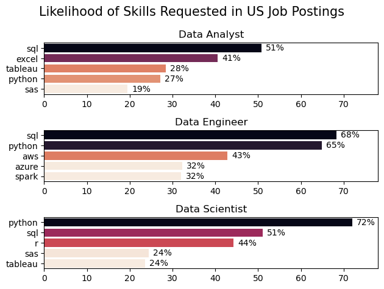
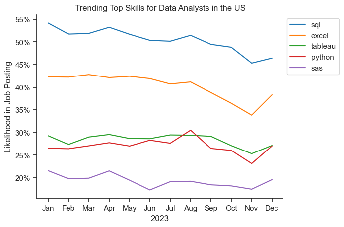
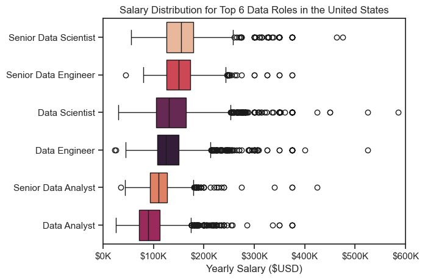
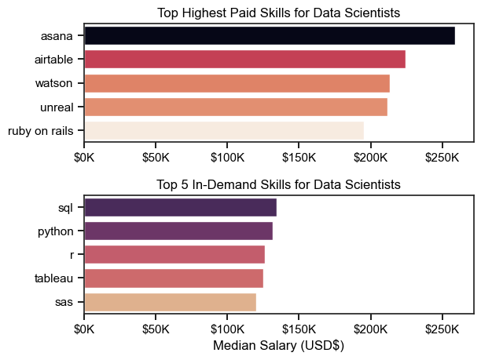
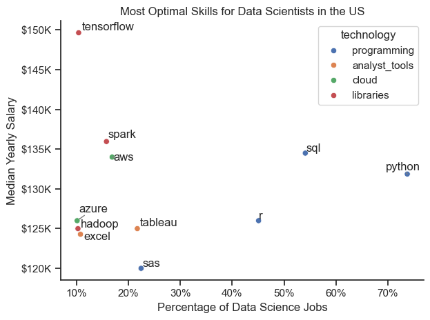

# Overview
Welcome to my first Python project. This project explores top-paying and in-demand skills for various data job roles. 

The data is from [luke Barousse's Python Course](https://youtu.be/wUSDVGivd-8?si=lzQans0aSTNDSogc).

# Questions
Below are the questions answered in the project
1. What skills are in demand for the top 3 most popular data roles?
2. How are in-demand skills trending for Data Analysts
3. Salary Analysis <br>
 a. Salary Distribution for Top 6 Data Roles <br>
 b. Highest Paid Skills & In-Demand Skills For Data Scientists
4. What are the optimal skills for Data Scientists according to core technologies
 
# Tools I Used
- Python: Enabled me to analyze the data and find crucial insights. I also used the following libraries.<br>
 1.Pandas Library - to analyze data <br>2.Matplolib Library - for visualization <br>3.Seaborn Library - for advaced visualization
- Jupyter Notebook
- Visual Studio Code 
- Git and GitHub 
 

# The Analysis

## 1. What skills are in demand for the top 3 most popular data roles?

To achieve this, I filtered out the data roles that were most popular and got the top 5 skills associated with them. For a person seeking to go into any of these roles, this analysis provides the skills they should pay more attention to. 

View steps here:<br>
[2_skills_demand](3_project/2_skills_demand.ipynb)

### Results
 <br>
 *Bar Chart showing top Roles and their corresponding top 5 skills*

### Insights

- Python is mostly required by Data Scientists (72%) and Data Engineers (65%). It can also be a plus for Data Analysts. 
- SQL is requested in all three job roles, especially for Data Analysts and Data Engineers. 
- Data Engineers require cloud platform knowledge (AWS, Azure) and big data tools (Spark). 
- Data Analysts and Data Scientists can also learn SAS to add to their tools stack. 

## 2. How are in-demand skills trending for Data Analysts 

View steps here:<br>
[Skills_Trend](3_project/3_skills_trend.ipynb)

### Visualization
```python
from matplotlib.ticker import PercentFormatter
df_plot = df_DA_USA_perc.iloc[:, :5]

sns.lineplot(data = df_plot, dashes = False, palette = 'tab10')

plt.title('Trending Top Skills for Data Analysts in the US')
plt.xlabel('2023')
plt.ylabel('Likelihood in Job Posting')
plt.legend(loc='upper left', bbox_to_anchor=(1, 1))

ax = plt.gca()
ax.yaxis.set_major_formatter(PercentFormatter(decimals=0))

plt.show()
```
### Results
 <br>
*Line Chart showing the trending skills for Data Analysts in the US in 2023.*

 ### Insights

 - SQL consistently has the highest demand, hovering above 50% for most of the year.
 - Excel starts the year strong at around 42% likelihood in job postings but experiences a noticeable decline from mid-year, reaching its lowest in November. Despite this decline, Excel remains a key skill in job postings.
 - Python and Tableau demand hovers around 25%-30%, indicating that these skills are secondary but important for data analysts.
 - SAS is the least demanded skill. 

 ## 3. Salary Analysis
View steps here:<br>
[Salary_Analysis](3_project/4_salary_analysis.ipynb)
### A. Salary Distribution for Top 6 Data Roles

#### Results
 <br>
*Boxplots showing salary distribution for the top 6 data roles in the United States*

 #### Insights

 - Senior Data Scientists and Senior Data Engineers earn significantly more than Data Analysts and Senior Data Analysts. 
 - Many outliers indicate that top professionals in these fields can earn well beyond the typical range due to various factors like experience and location.
 - Data Analysts have the lowest earning potential, making it crucial to upskill.
 -  Higher seniority leads to higher salaries in all roles. 

### B. Highest Paid Skills & In-Demand Skills For Data Scientists
#### Results 
 <br>
*Boxplots showing salary distribution for the top 6 data roles in the United States*

 #### Insights

 - The top graph shows specialized technical skills like Asana and Airtable are associated with higher salaries.
 - The bottom graph shows that skills such as SQL, Python and R are in demand for Data Scientists. 
 - Data Scientists should consider having diverse skills that include both high-paying skills and in-demand foundational skills.
 
 ## 4. Optimal Skills for Data Scientists According to Core Technologies

 View steps here:<br>
[Optimal_skills](3_project/5_optimal_skills.ipynb)

#### Results
 
*Scatterplots showing optimal skills for Data Scientists in the United States*

 #### Insights

 - Python and SQL are the most in-demand skills.
 - Higher salaries are associated with certain libraries(Tensorflow, Spark) and cloud technologies(AWS).
 - Analyst tools have lower demand and salaries.
 -  Cloud technologies are important and have great salaries but are less common (AWS, Azure, and Hadoop appear in fewer job postings).
 
